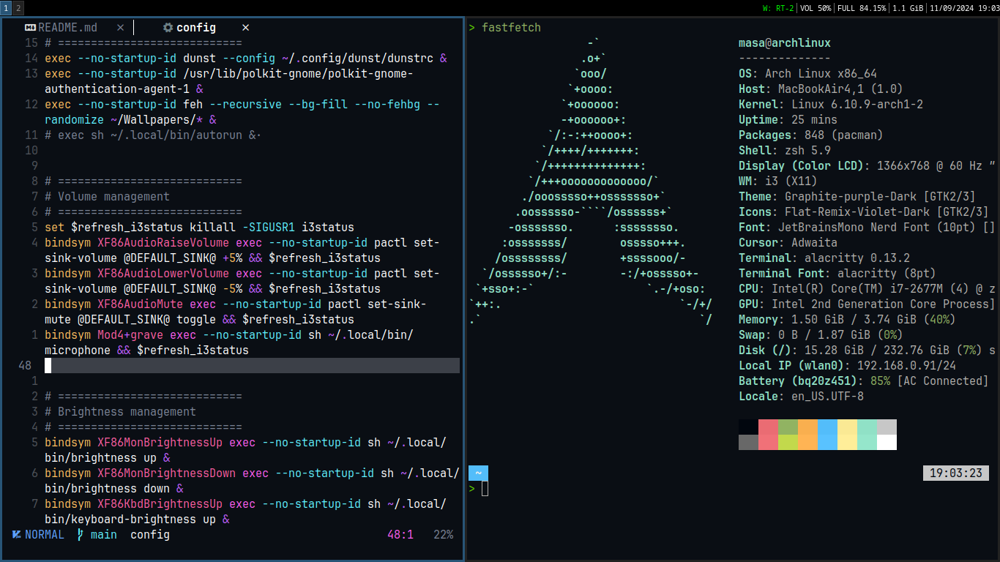

# Arch i3wm configuration

<p align="center">
  
</p>

## Description

This is my **personal** _Arch Linux i3wm_ configuration for macbook air 2011. Please ensure that the packages I use suit your needs before installation. You can find the [Hotkeys Table](hotkeys.md) here.

|       OS       |               [Arch Linux](https://archlinux.org/)               |
| :------------: | :--------------------------------------------------------------: |
|   AUR Helper   |               [Yay](https://github.com/Jguer/yay)                |
|     Shell      |                     [Zsh](https://ohmyz.sh)                      |
| Window Manager |                 [i3wm](https://github.com/i3/i3)                 |
|      Menu      |            [Rofi](https://github.com/davatorium/rofi)            |
|    Terminal    |       [Alacritty](https://github.com/alacritty/alacritty)        |
|  File Manager  |                [Yazi](https://yazi-rs.github.io)                 |
|    Browser     | [Chromium](https://archlinux.org/packages/extra/x86_64/chromium) |
|  Text Editor   |                   [Neovim](https://neovim.io)                    |

### Installation

#### AUR Helper

The initial installation of [Yay](https://github.com/Jguer/yay).

```sh
$ sudo pacman -Syu --needed neovim reflector git base-devel
$ git clone https://aur.archlinux.org/yay.git
$ cd yay && makepkg -si
$ cd ~ && rm -rf yay
```

#### Makepkg

To speed up the compilation of packages, edit the `makepkg.conf` file (use _nproc_ for see amount of CPU cores):

```sh
$ sudo nvim /etc/makepkg.conf

MAKEFLAGS="-j4"
```

#### Pacman

Enable parallel downloading of packages by editing the `pacman.conf` file:

```sh
$ sudo nvim /etc/pacman.conf

Color
ParallelDownloads = 4
```

#### Clone repository

Clone the repository and update submodules:

```sh
$ git clone --depth=1 --recurse-submodules https://github.com/masajinobe-ef/i3wm-air
$ cd i3wm-air && git submodule update --remote --merge
```

---

#### Installing packages

> Assuming your **AUR Helper** is [Yay](https://github.com/Jguer/yay), run:

```sh
$ yay -S --needed --noconfirm \

# X11
xorg-server \
xorg-xinit xorg-xrandr xorg-xsetroot  xorg-xset \

# System
i3-wm i3status \
rofi \
alacritty zsh \
dunst libnotify \
feh \
chromium \

# Drivers and etc. (Intel)
mesa lib32-mesa mesa-utils xf86-video-intel xf86-input-libinput broadcom-wl \
libva libva-intel-driver libva-utils libvdpau libvdpau-va-gl \
acpid cronie auto-cpufreq brightnessctl \
networkmanager nm-connection-editor \

# File manager
xdg-user-dirs yazi imagemagick thunar tumbler lxappearance-gtk3 xreader \
ffmpegthumbnailer perl-image-exiftool ueberzugpp \
polkit-gnome \

# Editor
neovim \

# Media
mpv \

# CLI
tmux \
git lazygit stow \
yt-dlp ffmpeg \
fastfetch btop eza \
fzf fd ripgrep \
bat bat-extras rsync curl wget \
maim xdotool xclip \
zoxide aria2 hyperfine \
xsel reflector jq man-db poppler \

# Dev
go rust nodejs npm yarn \

# Archiver
p7zip unrar zip unzip \

# Fonts & Icons
ttf-jetbrains-mono-nerd noto-fonts \
noto-fonts-emoji noto-fonts-cjk ttf-cascadia-code-nerd papirus-icon-theme
```

#### Copy configuration files

Copy the configuration files to the appropriate directories:

```sh
$ sudo chmod +x symlinks.sh
$ ./symlinks.sh
```

#### Blacklist, keyboard, mkinitcpio (only for macbook)

```sh
$ sudo nvim /etc/modprobe.d/blacklist.conf

blacklist ssb
blacklist mmc_core
blacklist b43
blacklist brcmsmac
blacklist brcmutil
blacklist cordic
blacklist mac80211
blacklist bcma
blacklist iTCO_wdt
blacklist iTCO_vendor_support

$ sudo modprobe wl
$ sudo nvim /etc/modprobe.d/hid_apple.conf

options hid_apple fnmode=2 iso_layout=1

$ sudo nvim /etc/mkinitcpio.conf

# add vfat to other modules for fix "Failed to mount /boot ... unknown filesystem vfat"
MODULES=(vfat)

$ sudo mkinitcpio -P
```

#### Config GRUB (only for macbook)

```sh
$ sudo nvim /etc/default/grub

GRUB_CMDLINE_LINUX_DEFAULT="loglevel=3 quiet mitigations=off intel_pstate=disable nowatchdog"

$ sudo grub-mkconfig -o /boot/grub/grub.cfg
```

#### Daemons

Enable and start necessary services:

```sh
$ sudo systemctl enable sshd.service --now
$ sudo systemctl enable acpid.service --now
$ sudo systemctl enable NetworkManager.service --now
$ sudo systemctl enable cronie.service --now
$ sudo systemctl enable auto-cpufreq.service --now
$ sudo systemctl enable fstrim.timer
$ sudo systemctl enable reflector.timer
```

---

#### Setting-up

Adding languages to your system:

```sh
$ sudo nvim /etc/locale.gen

ru_RU.UTF-8 UTF-8

$ sudo locale-gen
```

Set the keyboard layout in X11:

```sh
$ sudo localectl --no-convert set-x11-keymap us,ru pc105+inet qwerty grp:caps_toggle
```

Configure the touchpad settings:

```sh
$ sudo nvim /etc/X11/xorg.conf.d/30-touchpad.conf

Section "InputClass"
    Identifier "touchpad"
    Driver "libinput"
    MatchIsTouchpad "on"
    Option "NaturalScrolling" "true"
    Option "Tapping" "on"
    Option "ClickMethod" "buttonareas"
    Option "AccelProfile" "adaptive"
    Option "ScrollMethod" "twofinger"
    Option "DisableWhileTyping" "true"
    Option "PalmDetection" "true"
    Option "ButtonAreas" "50% 0 100% 50% 0 0 50% 0"
    Option "TransformationMatrix" "1 0 0 0 1 0 0 0 1"
EndSection
```

Configure the mouse settings:

```sh
$ sudo nvim /etc/X11/xorg.conf.d/30-pointer.conf

Section "InputClass"
    Identifier "pointer"
    Driver "libinput"
    MatchIsPointer "on"
    Option "NaturalScrolling" "false"
    Option "AccelProfile" "flat"
    Option "TransformationMatrix" "1 0 0 0 1 0 0 0 2.0"
EndSection
```

Configure reflector (pacman mirrors):

```sh
$ sudo nvim /etc/xdg/reflector/reflector.conf

--save /etc/pacman.d/mirrorlist
--protocol https
--country France,Germany,Finland,Russia,Netherlands
--latest 10
--sort rate
--age 12
```

Install Oh My Zsh:

```sh
$ sh -c "$(curl -fsSL https://raw.githubusercontent.com/ohmyzsh/ohmyzsh/master/tools/install.sh)"
```

Consider installing the following plugins for Zsh:

- [powerlevel10k](https://github.com/romkatv/powerlevel10k?tab=readme-ov-file#oh-my-zsh)
- [zsh-autopair](https://github.com/hlissner/zsh-autopair?tab=readme-ov-file#oh-my-zsh)
- [zsh-autosuggestions](https://github.com/zsh-users/zsh-autosuggestions/blob/master/INSTALL.md#oh-my-zsh)
- [zsh-history-substring-search](https://github.com/zsh-users/zsh-history-substring-search?tab=readme-ov-file#install)
- [zsh-syntax-highlighting](https://github.com/zsh-users/zsh-syntax-highlighting/blob/master/INSTALL.md#oh-my-zsh)

Config tasks

To randomize wallpapers by time using feh, add the following line to your crontab:

```sh
*/1 * * * * DISPLAY=:0 feh --recursive --bg-fill --no-fehbg --randomize ~/Wallpapers/* &
```
